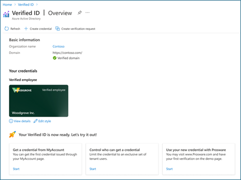
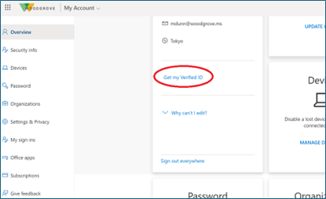
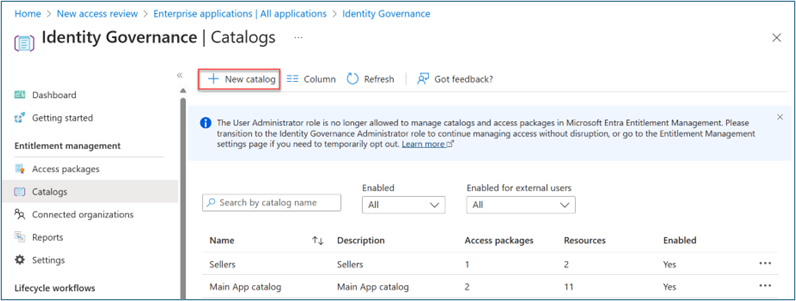
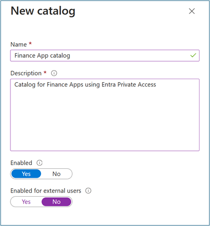
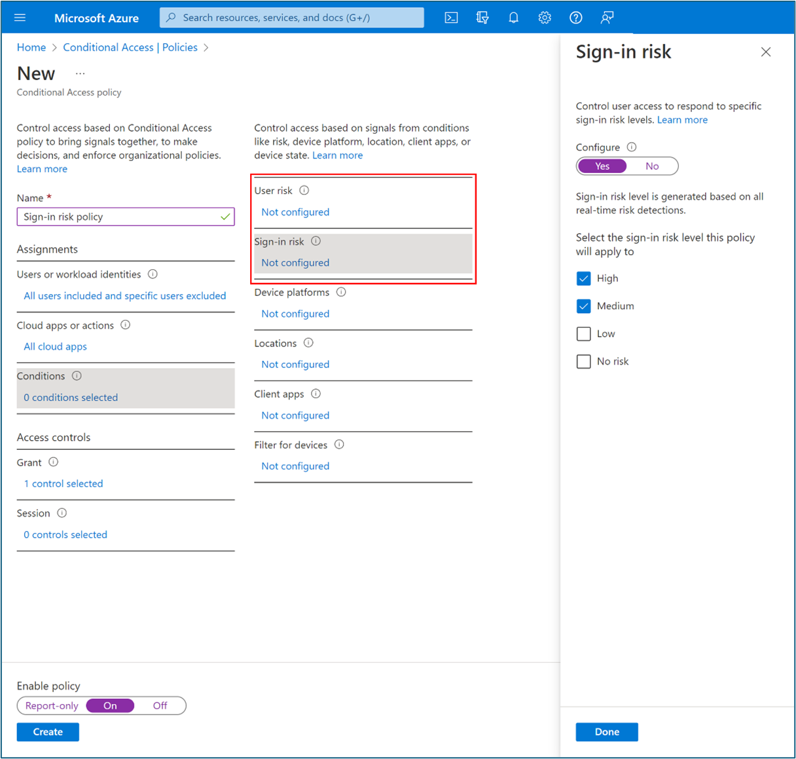
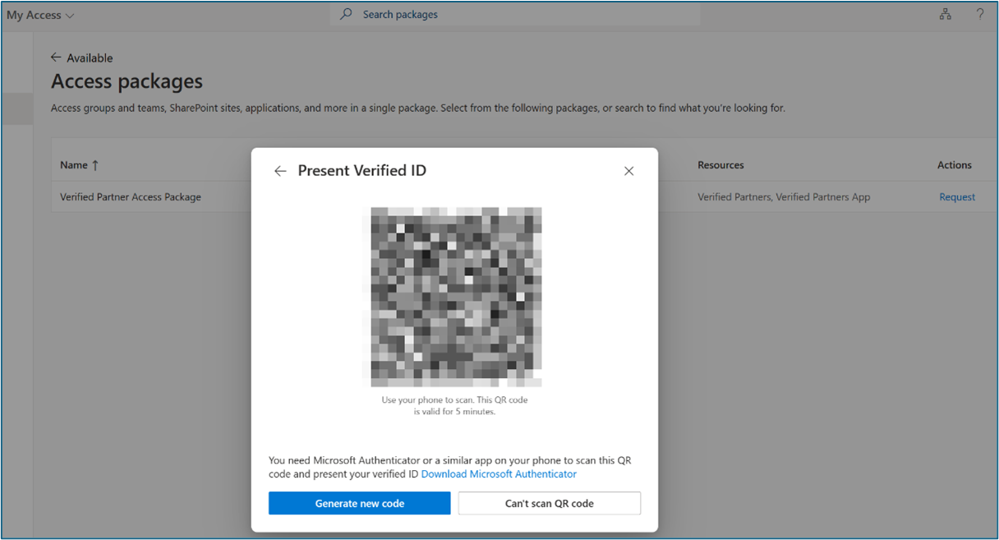

## Microsoft Entra Suite – Scenario 1
### Enhanced workforce and guest lifecycle (Secure and governed access to all applications and resources)

#### Introduction
In this guide, we describe how to configure Microsoft Entra Suite products for a scenario in which the fictional organization, Contoso, wants to hire new remote employees and provide them with secure and seamless access to necessary apps and resources. 
They want to invite and collaborate with external users (such as partners, vendors, or customers) and provide them with access to relevant apps and resources. 

Contoso uses Microsoft Entra Verified ID to issue and verify digital proofs of identity and status for new remote employees (based on human resources data) and external users (based on email invitations). Digital wallets store identity proof and status to allow access to apps and resources. As an additional security measure, Contoso may verify identity with FaceCheck facial recognition based on the picture that the credential stores.

They use Microsoft Entra ID Governance to create and grant access packages for employees and external users based on verifiable credentials. 

•	For employees, they base access packages on job function and department. Access packages include cloud and on-premises apps and resources to which employees need access.

•	For external collaborators, they base access packages on based on invitation to define external user roles and permissions. The access packages include only apps and resources to which external users need access.

Employees and external users can request access packages through a self-service portal and provide their digital proofs as identity verification. With single sign-on and multifactor authentication, employees and external users use Microsoft Entra accounts to access apps and resources that their access packages include. Contoso verifies credentials and grants access packages without requiring manual approvals or provisioning.

Contoso uses Microsoft Entra Identity Protection and Conditional Access (CA) to monitor and protect accounts from risky sign-ins and user behavior. They enforce appropriate access controls based on location, device, and risk level

## Configure prerequisites
To successfully deploy and test the solution, configure the prerequisites that we describe in this section.
Configure Microsoft Entra Verified ID
For this scenario, complete these prerequisite steps to configure Microsoft Entra Verified ID with Quick setup (Preview):

1.	Register a custom domain (required for Quick setup) by following the steps in the [Add your custom domain](https://learn.microsoft.com/en-us/entra/fundamentals/add-custom-domain) article.
2.	Sign in to the Microsoft Entra admin center with at least a Global Administrator role.
	
* Select **Verified ID**.
* Select **Setup**.
* Select **Get started**

3.	If you have multiple domains registered for your Microsoft Entra tenant, select the one that you would like to use for Verified ID.
	
4.	After the setup process is complete, you see a default workplace credential available to edit and offer to employees of your tenant on their **My Account** page.
	
	
	
5.	Sign in to the test user’s **My Account** with their Microsoft Entra credentials. Select **Get my Verified ID** to issue a verified workplace credential
	
	

	
## Add trusted external organization (B2B)
Follow these prerequisite steps to add a trusted external organization (B2B) for the scenario.
1.	Sign in to the Microsoft Entra admin center with at least a Security Administrator role.
2.	Go to **Identity > External Identities > Cross-tenant access settings**. Select **Organizational settings**
3.	Select **Add organization**.
4.	Enter the organization’s full domain name (or tenant ID).
5.	Select the organization in the search results. Select **Add**.
6.	Confirm the new organization (that inherits its access settings from default settings) in **Organizational settings**.
	![image 3] (../images/VID-03.png)

## Create catalog
Follow these prerequisite steps to create an Entitlement management catalog for the scenario.
1.	Sign in to the Microsoft Entra admin center with at least an Identity Governance Administrator role.
2.	Go to **Identity governance > Entitlement management > Catalogs**.
3.	Select **+New catalog**.

	

4.	Enter a unique name for the catalog and provide a description. Requestors see this information in an access package's details.
5.	To create access packages in this catalog for internal users, select **Enabled for external users > No**.

	

6.	On **Catalog**, open the catalog to which you want to add resources. Select **Resources > +Add resources**.
7.	Select **Type**, then **Groups and Teams, Applications**, or **SharePoint sites**.
8.	Select one or more resources of the type that you want to add to the catalog. Select **Add**.

## Create access packages
To successfully deploy and test the solution, configure the access packages that we describe in this section.
## Access package for remote users (internal)
Follow these steps to create an access package in entitlement management with Verified ID for remote (internal) users.
1.	Sign in to the Microsoft Entra admin center with at least an Identity Governance Administrator role.
2.	Go to **Identity governance > Entitlement management > Access package**.
3.	Select **New access package**.
4.	For **Basics**, give the access package a name (such as Finance Apps for Remote Users). Specify the catalog that you previously created.
5.	For Resource roles, select a resource type (for example: Groups and Teams, Applications, SharePoint sites). Select one or more resources.
6.	In **Role**, select the role to which you want users assigned for each resource. 

    

7.	For **Requests**, select **For users in your directory**.
8.	In **Select users and groups**, select **For Users in your directory**. Select **+ Add users and groups**. Select an existing group entitled to request the access package.
9.	Scroll to **Required Verified Ids**.
10.	Select **+ Add issuer**. Select an issuer from the Microsoft Entra Verified ID network. Ensure that you select an issuer from an existing verified identity in the guest wallet.
11.	**Optional:** In **Approval**, specify whether approval is required when users request the access package. 
12.	**Optional:** In **Requestor information**, select **Questions**. Enter a question that you want to ask the requestor. This question is known as the display string. To **add localization** options, select Add localization.
13.	For **Lifecycle**, specify when a user's assignment to the access package expires. Specify whether users can extend their assignments. For **Expiration**, set **Access package assignments** expiration to **On date, Number of days, Number of hours, or Never**.
14.	In **Access Reviews**, select **Yes**.
15.	In **Starting on**, select the current date. Set **Review Frequency** to **Quarterly**. Set **Duration (in Days)** to **25**.

## Access package for guests (B2B) 
Follow these steps to create an access package in entitlement management with Verified ID for guests (B2B).
1.	Sign in to the Microsoft Entra admin center with at least an Identity Governance Administrator role.
2.	Go to **Identity governance > Entitlement management > Access package**.
3.	Select **New access package**.
4.	For **Basics**, give the access package a name (such as Finance Apps for Remote Users). Specify the catalog that you previously created.
5.	For **Resource roles**, select a resource type (for example: Groups and Teams, Applications, SharePoint sites). Select one or more resources.
6.	In **Role**, select the role to which you want users assigned for each resource. 
	
	

7.	For **Requests**, select **For users not in your directory**.
8.	Select **Specific connected organizations**. To select from a list of connected organizations that you previously added, select **Add directory**.
9.	Enter the name or domain name to search for a previously connected organization.
10.	Scroll to **Required Verified Ids**.
11.	Select **+ Add issuer**. Select an issuer from the Microsoft Entra Verified ID network. Ensure that you select an issuer from an existing verified identity in the guest wallet.
12.	**Optiona**l: In **Approval**, specify whether approval is required when users request the access package. 
13.	**Optional**: In **Requestor information**, select **Questions**. Enter a question that you want to ask the requestor. This question is known as the display string. To add localization options, select **Add localization**.
14.	For **Lifecycle**, specify when a user's assignment to the access package expires. Specify whether users can extend their assignments. For **Expiration**, set **Access package assignments expiration** to **On date, Number of days, Number of hours**, or **Never**.
15.	In **Access Reviews**, select **Yes**.
16.	In **Starting on**, select the current date. Set **Review Frequency** to **Quarterly**. Set **Duration (in Days)** to **25**.
17.	Select **Specific reviewers**. Select **Self Review**.
	
	

## Create sign-in risk-based CA policy

1.	Sign in to the Microsoft Entra admin center with at least a Conditional Access (CA) Administrator role.
2.	Go to **Protection > Conditional Access**.
3.	Select **New policy**.
4.	Enter a **policy name** such as Protect applications for remote high-risk sign-in users.
5.	For **Assignments**, select **Users**.
6.	For **Include**, select a **remote user group** or **select all users**.
7.	For **Exclude **, select **Users and groups**. Select your organization's emergency access or break-glass accounts.
8.	Select **Done**.
9.	For **Cloud apps or actions> Include**, select the application(s) to target this policy.
10.	For **Conditions > Sign-in risk**, set **Configure** to **Yes**. For **Select the sign-in risk level this policy will apply to**, select **High and Medium**.
11.	Select **Done**.
12.	For **Access controls > Grant**.
13.	Select **Grant access > Require multifactor authentication**.
14.	For **Session**, select **Sign-in frequency**. Select **Every time**.
15.	Confirm settings. Select **Enable policy**
	
	 

## Request access package
After you configure an access package with a Verified ID requirement, end-users who are within the scope of the policy can request access in their **My Access** portal. While reviewing requests for approval, approvers can see the claims of the verified credentials that requestors present.
1.	As a remote user or guest, sign in to **myaccess.microsoft.com*.
2.	Search for the access package that you previously created (such as Finance Apps for Remote Users). You can browse the listed packages or use the search bar. Select **Request**.
3.	The system displays an information banner with a message such as, To request access to this access package you need to present your Verifiable Credentials. Select **Request Access**. Scan the QR Code with your phone to launch Microsoft Authenticator. Share your credentials.
	
	

5.	After you share your credentials, continue with the approval workflow.
6.	**Optional**: Simulate user risk by following these instructions: [Simulating risk detections in Microsoft Entra ID Protection](https://learn.microsoft.com/en-us/entra/id-protection/howto-identity-protection-simulate-risk). You may need to try multiple times to raise the user risk to medium or high.
7.	Try accessing the application that you previously created for the scenario to confirm blocked access. You may need to wait up to one hour for block enforcement.
8.	Validate that access is blocked by the Conditional Access (CA) policy that you created earlier using sign-in logs. Open non-interactive sign in logs from the ZTNA Network Access Client – Private application. View logs from the Private Access application name that you previously created as the **Resource name**.

 
 
 ## Resources 
* [Microsoft Entra Verified ID | Microsoft Security](https://www.microsoft.com/en-us/security/business/identity-access/microsoft-entra-verified-id) 
* [Plan your Microsoft Entra Verified ID verification solution](https://learn.microsoft.com/en-us/entra/verified-id/plan-verification-solution) 
* [What is Microsoft Entra ID Protection?](https://learn.microsoft.com/en-us/entra/id-protection/overview-identity-protection) 
* [Microsoft Entra ID Governance](https://learn.microsoft.com/en-us/entra/id-governance/identity-governance-overview)
* [Plan a Microsoft Entra Conditional Access deployment](https://learn.microsoft.com/en-us/entra/identity/conditional-access/plan-conditional-access)

 

