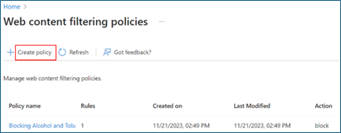
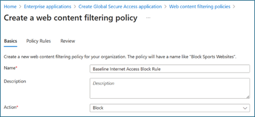
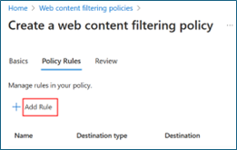
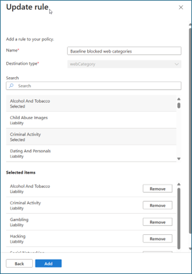
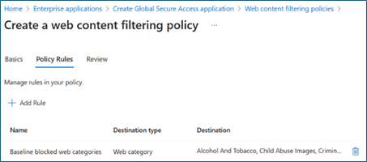
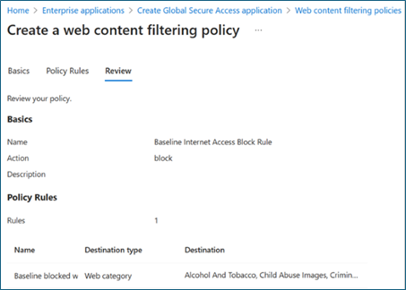
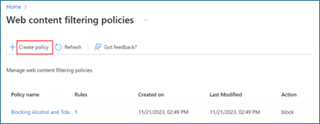

## Microsoft Entra Suite – Scenario 3

## Govern internet access based on business needs (Secure and governed access to all applications and resources)

## Introduction
In this guide, we describe how to configure Microsoft Entra Suite products for a scenario in which the fictional organization, Contoso has strict default internet access policies and wants to control internet access according to business requirements.

In an example scenario for which we describe how to configure its solution in this guide, a Marketing department user requires access to social networking sites that Contoso prohibits for all users. Users can request access in [My Access](https://learn.microsoft.com/en-us/entra/id-governance/my-access-portal-overview). Upon approval, they become a member of a group that grants them access to social networking sites.

In another example scenario and corresponding solution, a SOC analyst needs to access a group of high-risk internet destinations for a specific time to investigate an incident. The SOC analyst can make that request in My Access. Upon approval, they become a member of a group that grants them access to high-risk internet destinations. 

You can replicate these high-level steps for the Contoso solution as described in this guide.
1.	Sign up for Microsoft Entra Suite. Enable and configure Microsoft Entra Internet Access for desired network and security settings.
2.	Deploy [Microsoft Global Secure Access clients](https://learn.microsoft.com/en-us/entra/global-secure-access/concept-clients) on users’ devices. Enable Microsoft Entra Internet Access.
3.	Create a security profile and web content filtering policies with a restrictive baseline policy that blocks specific web categories and web destinations for all users.
4.	Create a security profile and web content filtering policies that allows access to social networking sites.
5.	Create a security profile that enables the Hacking web category. 
6.	Use [Microsoft Entra ID Governance](https://learn.microsoft.com/en-us/entra/id-governance/identity-governance-overview) to allow users requesting access to access packages such as: 
    * Marketing department users can request access to social networking sites with a quarterly access review. 
    * SOC team members can request access to high-risk internet destinations with a time limit of eight hours.
7.	Create and link two [Conditional Access policies](https://learn.microsoft.com/en-us/entra/identity/conditional-access/plan-conditional-access) using the Global Secure Access security profile session control. Scope the policy to groups of users for enforcement.
8.	Confirm that traffic is appropriately granted with traffic logs in Global Secure Access. Ensure that Marketing department users can access the access package in the My Access portal.
These are the benefits of using these solutions together:
    * **Least privilege access to internet destinations**. Reduce internet resource access to only what the user requires for their job role through the joiner/mover/leaver cycle. This approach reduces end user and device compromise risk.
    * **Simplified and unified management**. Manage network and security functions from a single cloud-based console, reducing complexity and cost of maintaining multiple solutions and appliances.
    * **Enhanced security and visibility**. Enforce granular and adaptive access policies based on user and device identity and context, as well as app and data sensitivity and location. Enriched logs and analytics provide gain insights into network and security posture to more quickly detect and respond to threats. 
    * **Improved user experience and productivity**. Provide fast and seamless access to necessary apps and resources without compromising security or performance

## Requirements
This section defines the requirements for the scenario solution.

### Permissions

Administrators who interact with Global Secure Access preview features require the Global Secure Access Administrator and Application Administrator roles.

Conditional Access (CA) policy configuration requires the Conditional Access Administrator or Security Administrator role. Some features may require additional roles.

Identity Governance configuration requires at least the Identity Governance Administrator role.

### Licenses
To implement all the steps in this scenario, you need Microsoft Entra ID P1 for Global Secure Access (while the product is in Public Preview) and Microsoft Entra Governance licenses. You can [purchase licenses or obtain trial licenses](https://www.microsoft.com/en-us/security/business/microsoft-entra-pricing).

### Users and devices prerequisites
To successfully deploy and test this scenario, configure for these prerequisites:

1.	Microsoft Entra tenant with Microsoft Entra ID P1 license. Configure Microsoft Entra ID P2 to test Identity Protection. Purchase licenses or obtain trial licenses.
    * One user with at least Global Secure Access Administrator and Application Administrator roles to configure Microsoft's Security Service Edge
    * At least one user as client test user in your tenant
2.	One Windows client device with this configuration:
    * Windows 10/11 64-bit version
    * Microsoft Entra joined or hybrid joined
    * Internet connected
3.	Download and install Global Secure Access Client on client device. The [Global Secure Access Client for Windows](https://learn.microsoft.com/en-us/entra/global-secure-access/how-to-install-windows-client) article describes prerequisites and installation.

## Configure Global Secure Access
In this section, we activate Global Secure Access through the Microsoft Entra admin center. We then set up the required initial configurations for the scenario.

1.	Sign in to the Microsoft Entra admin center with at least a Global Administrator role.
2.	Go to **Global Secure Access > Get started > Activate Global Secure Access in your tenant**. Select **Activate** to enable SSE features.
    
3.	Go to **Global Secure Access > Connect > Traffic forwarding**. Toggle on Private access profile. Traffic forwarding enables you to configure the type of network traffic to tunnel through Microsoft’s Security Service Edge Solution services. Set up [traffic forwarding profiles](https://learn.microsoft.com/en-us/entra/global-secure-access/concept-traffic-forwarding) to manage traffic types. 
    * The **Microsoft access profile** is for Microsoft 365 access. 
    * The **Private access profile** is for Microsoft Entra Private Access. 
    * The **Internet access profile** is for Microsoft Entra Internet Access. Microsoft's Security Service Edge solution only captures traffic on client devices with Global Secure Access Client installation.
    

## Install Global Secure Access client
Microsoft Entra Internet Access for Microsoft 365 and Microsoft Entra Private Access use the Global Secure Access client on Windows devices. This client acquires and forwards network traffic to Microsoft's Security Service Edge solution. Perform these installation and configuration steps:

1.	Ensure that the Windows device is Microsoft Entra joined or hybrid joined.
2.	Sign in to the Windows device with a Microsoft Entra user role with local admin privileges.
3.	Sign in to the Microsoft Entra admin center with at least a Global Administrator role.
4.	Go to **Global Secure Access** > Connect > Client Download. Select Download client. Complete the installation.
    

5.	In the Window taskbar, the Global Secure Access Client first appears as disconnected. After a few seconds, when prompted for credentials, enter test user's credentials.
6.	In the Window taskbar, hover over the Global Secure Access Client icon and verify **Connected** status.

## Create security groups
In this guide, we use two security groups to assign security profiles using Conditional Access (CA) policies. In the Microsoft Entra Portal, create security groups with these names:
1.	Internet Access – Allow Social Networking sites
2.	Internet Access – Allow Hacking sites
Don’t add any members to these groups. Later in this guide, we configure Identity Governance to add members on request.

## Block access with baseline profile
In this section, we block access to inappropriate sites for all users in the organization with a baseline profile.

Create a web filtering policy
1.	Sign in to the Microsoft Entra admin center. Go to **Global Secure Access** > Secure > Web content filtering policies > Create policy > [Configure Global Secure Access content filtering](https://learn.microsoft.com/en-us/entra/global-secure-access/how-to-configure-web-content-filtering).
 
    
2.	On **Create a web content filtering policy > Basics**, complete these fields:
    * **Name:** Baseline Internet Access Block Rule
    * **Description:** Add a description
    * **Action:** Block
    
    
3.	Select **Next**.
4.	On **Create a web content filtering policy > Policy Rules**, select **Add Rule**.

    
5.	In Add Rule, complete these fields:
    * **Name:** Baseline blocked web categories
    * **Destination type:** webCategory
6.	**Search:** Select the following categories. Confirm that they are in **Selected items**.
    * Alcohol and Tobacco
    * Criminal Activity
    * Gambling
    * Hacking
    * Illegal Software
    * Social Networking
    
    
7.	Select **Add**.
8.	On **Create a web content filtering policy > Policy Rules**, confirm your selections.

    
9.	Select **Next**.
10.	On **Create a web content filtering policy > Review**, confirm your policy configuration.
11.	Select **Create policy**.
    

12.	To confirm policy creation, view it in **Manage web content filtering policies**.

## Configure baseline security profile
1.	Sign in to the Microsoft Entra admin center. Go to **Global Secure Access > Secure > Security profiles**. 
2.	Select **Baseline Profile**.
3.	On **Basics**, set **State** to enabled. 
4.	Select **Save**.
5.	On **Edit Baseline Profile**, select **Link policies**. Select **Link a policy**. Select **Existing policy**. Complete these fields:
    * **Link a policy:** Select Policy name and Baseline Internet Access Block Rule
    * **Priority:** 100
    * **State:** Enabled
6.	Select **Add**.
7.	On **Create a profile > Link policies**, confirm **Baseline Internet Access Block Rule** is listed.
8.	Close the baseline security profile.

## Allow access to social networking sites
In this section, we create a security profile that allows access to social networking sites for users that request it.
### Create web filtering policy
1.	Sign in to the Microsoft Entra admin center. Go to **Global Secure Access > Secure > Web content filtering policies > Create policy >** [Configure Global Secure Access content filtering](https://learn.microsoft.com/en-us/entra/global-secure-access/how-to-configure-web-content-filtering).
    
2.	On **Create a web content filtering policy > Basics**, complete these fields:
    * **Name:** Allow Social Networking sites
    * **Description:** Add a description
    * **Action:** Allow
3.	Select **Next**.
4.	On **Create a web content filtering policy > Policy Rules**, select **Add Rule**.
5.	In **Add Rule**, complete these fields:
    * **Name:** Social networking
    * **Destination type:** webCategory
    * **Search:** Social
6.	Select **Social Networking**
7.	Select **Add**.
8.	On **Create a web content filtering policy > Policy Rules**, select **Next**.
9.	On **Create a web content filtering policy > Review**, confirm your policy configuration.
    
10.	Select **Create policy**.
11.	To confirm policy creation, view it in **Manage web content filtering policies**.

