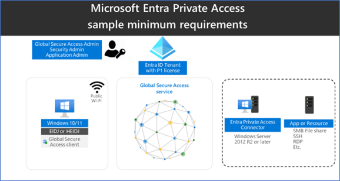
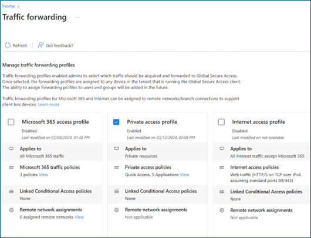
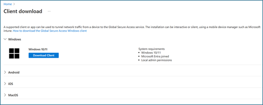
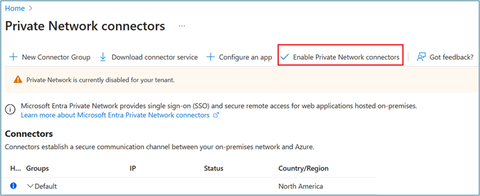
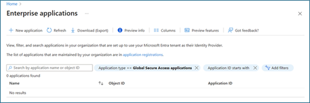
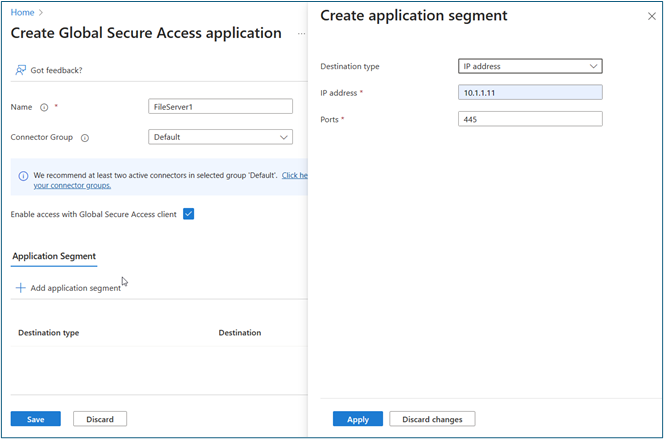
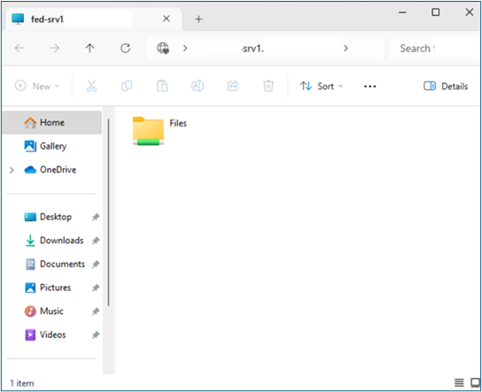

## Microsoft Entra Suite – Scenario 2

## Modernize remote access (Secure and governed access to all applications and resources)

## Introduction
In this guide, we describe how to configure Microsoft Entra Suite products for a scenario in which the fictional organization, Contoso, is upgrading their existing VPN solution. The new, scalable cloud-based solution helps them to move towards Secure Access Service Edge (SASE). To accomplish this objective, they deploy [Microsoft Entra Internet Access](https://learn.microsoft.com/en-us/entra/global-secure-access/concept-internet-access), [Microsoft Entra Private Access](https://learn.microsoft.com/en-us/entra/global-secure-access/concept-private-access), and [Microsoft Entra ID Protection](https://learn.microsoft.com/en-us/entra/id-protection/overview-identity-protection).

Microsoft Entra Private Access provides users (whether in an office or working remotely) secure access to private corporate resources. Microsoft Entra Private Access builds on the Microsoft Entra application proxy to extend access to any private resource, independent of TCP/IP port and protocol.

Remote users can connect to private apps across hybrid and multi-cloud environments, private networks, and data centers from any device and network without requiring a VPN solution. The service offers per-app adaptive access based on Conditional Access (CA) policies for more granular security than a traditional VPN solution.

Microsoft Entra ID Protection cloud-based identity and access management (IAM) solution helps protect user identities and credentials from compromise.

You can replicate these high-level steps for the Contoso solution as described in this guide.
1.	Sign up for Microsoft Entra Suite. Enable and configure Microsoft Entra Internet and Private Access to desired network and security settings.
2.	Deploy [Microsoft Global Secure Access client](https://learn.microsoft.com/en-us/entra/global-secure-access/how-to-install-windows-client) on user devices and [Microsoft Entra Private Access connector](https://learn.microsoft.com/en-us/entra/architecture/sse-deployment-guide-private-access)s on private networks. Include multi-cloud IaaS based virtual networks to access apps and resources on Contoso networks.
3.	Set up private apps as [Global Secure Access apps](https://learn.microsoft.com/en-us/entra/global-secure-access/how-to-configure-per-app-access). Assign appropriate users and groups. Set up [Conditional Access policies](https://learn.microsoft.com/en-us/entra/identity/conditional-access/plan-conditional-access) for those apps and users. With this setup, you can achieve minimum access by allowing access only to users and groups that require access.
4.	Enable Microsoft [Entra ID Protection](https://learn.microsoft.com/en-us/entra/id-protection/overview-identity-protection) for users to allow administrators to investigate and remediate risks to keep organizations safe and secure. Risks can be fed into tools like Conditional Access to make access decisions and fed back to a security information and event management (SIEM) tool for investigation.
5.	Use enhanced logs and analytics from Microsoft Entra Internet Access, Microsoft Entra Private Access, and Microsoft Entra ID Identity Protection to track and evaluate network and security status. This configuration helps your Security Operations Center (SOC) team to promptly detect and examine threats to prevent escalation.

Microsoft Entra solutions offer these advantages over VPN:
* Easier and consolidated management
* Lower expenses
* Better security and visibility
* Smoother user experience and efficiency
* Preparedness for SASE

These are the benefits of using these three solutions together:

* **Simplified and unified management**. Manage all network and security functions from a single cloud-based console to reduce the complexity and cost of maintaining multiple solutions and appliances.
* **Enhanced security and visibility**. Enforce granular and adaptive access policies based on identity and context of users and devices as well as application and data sensitivity and location. Use enriched logs and analytics to gain insights into network and security posture to detect and more quickly respond to threats.
* **Improved user experience and productivity**. Provide users with fast and seamless access to necessary apps and resources without compromising security or performance. Support hybrid and remote work scenarios with cloud-delivered solutions that scale on demand and adapt to changing network conditions.
* **Reduced costs and network complexity**. Reduce operational costs by eliminating the need to operate and monitor world-wide complex VPN gateway infrastructures. Leverage simplified access policies by using compliant network check with Conditional Access.

## Requirements
This section defines the requirements for this scenario’s solution.

## Permissions
Administrators who interact with Global Secure Access preview features require the Global Secure Access Administrator and Application Administrator roles.

Conditional Access (CA) policy configuration requires the Conditional Access Administrator or Security Administrator role. Some features may require additional roles.

## Prerequisites
To successfully deploy and test this scenario, configure these prerequisites:
1.	Microsoft Entra tenant with Microsoft Entra ID P1 license. Configure Microsoft Entra ID P2 to test Identity Protection. [Purchase licenses or obtain trial licenses](https://www.microsoft.com/en-us/security/business/microsoft-entra-pricing).
    * One user with at least Global Secure Access Administrator and Application Administrator roles to configure Microsoft's Security Service Edge
    * At least one user as client test user in your tenant
2.	One Windows client device with this configuration:
    * Windows 10/11 64-bit version
    * Microsoft Entra joined or hybrid joined
    * Internet connected and no corpnet access or VPN
3.	Download and install Global Secure Access Client on client device. The [Global Secure Access Client for Windows](https://learn.microsoft.com/en-us/entra/global-secure-access/how-to-install-windows-client) article describes prerequisites and installation.
4.	To test Microsoft Entra Private Access, configure a Windows server to function as the resource server:
    * Windows Server 2012 R2 or later
    * A file share
5.	To test Microsoft Entra Private Access, configure a Windows server to function as the connector server:
    * Windows Server 2012 R2 or later
    * Network connectivity to Microsoft Entra service
    * Ports 80 and 443 open to [outbound traffic](https://learn.microsoft.com/en-us/entra/global-secure-access/how-to-configure-connectors#open-ports)
    * Allow access to required URLs
6.	Establish connectivity between connector server and application server. Confirm access to test application on the application server (for example, successful file share access).

This diagram illustrates the minimum architecture requirements to deploy and test Microsoft Entra Private Access:

## Configure Global Secure Access
In this section, we activate Global Secure Access through the Microsoft Entra admin center. We then set up required initial configurations for this scenario.

1.	Sign in to the Microsoft Entra admin center with at least a Global Administrator role.
2.	Go to **Global Secure Access> Get started > Activate Global Secure Access in your tenant**. Select **Activate** to enable SSE features.

 

3.	Go to **Global Secure Access> Connect > Traffic forwarding**. Toggle on Private access profile. Traffic forwarding enables you to configure the type of network traffic to tunnel through Microsoft’s Security Service Edge Solution services. Set up [traffic forwarding profiles](https://learn.microsoft.com/en-us/entra/global-secure-access/concept-traffic-forwarding) to manage traffic types. 
    * The Microsoft 365 access profile is for Microsoft Entra Internet Access for Microsoft 365. 
    * The Private access profile is for Microsoft Entra Private Access. 
    * The Internet access profile is for Microsoft Entra Internet Access. Microsoft's Security Service Edge solution only captures traffic on client devices with Global Secure Access Client installation.
        
 

## Install Global Secure Access client

Microsoft Entra Internet Access for Microsoft 365 and Microsoft Entra Private Access use the Global Secure Access client on Windows devices. This client acquires and forwards network traffic to Microsoft's Security Service Edge Solution. Complete these installation and configuration steps:

1.	Ensure that the Windows device is Microsoft Entra joined or hybrid joined.
2.	Sign in to the Windows device with a Microsoft Entra user role with local admin privileges.
3.	Sign in to the Microsoft Entra admin center with at least a Global Administrator role.
4.	Go to **Global Secure Access> Connect > Client Download**. Select Download client. Complete the installation.

 

5.	In the Window taskbar, the Global Secure Access Client first appears as disconnected. After a few seconds, when prompted for credentials, enter test user's credentials.
6.	In the Window taskbar, hover over the Global Secure Access Client icon and verify **Connected** status.

## Set up connector server
The connector server communicates with Microsoft's Security Service Edge Solution as the gateway to the corporate network. It uses outbound connections through 80 and 443 and doesn't require inbound ports. Learn [How to configure connectors for Microsoft Entra Private Access](https://learn.microsoft.com/en-us/entra/global-secure-access/how-to-configure-connectors#open-ports). Complete these configuration steps:
1.	On the connector server, sign in to the Microsoft Entra admin center. Go to **Global Secure Access > Connect > Connectors. Select Enable Private Network connectors**.
    
2.	Select **Download connector service**.
3.	Follow the installation wizard to install the connector service on the connector server. When prompted, enter tenant credentials to complete installation.
4.	The connector server is installed when it appears in **Connectors**.
In this guide, we use the default connector group with one connector server. In a production environment, create connector groups with multiple connector servers. See detailed guidance for publishing apps on separate networks by using connector groups.

## Create security group
In this guide, we use a security group to assign permissions to the Private Access application and to target Conditional Access policies. 
1.	In the Microsoft Entra Portal, create a new cloud-only security group.
2.	Add test user as a member.

## Determine private resource to publish
In this guide, we use file share services as a sample resource. You can use any private application or resource. You need to know which ports and protocols the application uses to publish it with Microsoft Entra Private Access.

Identify a server with a file share to publish and note its IP address. File share services use port 445/TCP.

## Publish application
Microsoft Entra Private Access supports transmission control protocol (TCP) applications using any port. To connect to the file server (TCP port 445) over the internet, complete these steps:
1.	From the connector server, verify that you can access a file share on the file server.
2.	Sign in to the Microsoft Entra admin center. Go to **Global Secure Access> Applications > Enterprise applications > + New Application**.
    
3.	Enter a **Name** (such as *FileServer1*). Select the default connector group. Select **+Add application segment**. Enter the **IP address** of the application server and port 445.

    

4.	Select **Apply > Save**. Verify that the application is in **Enterprise applications**.
5.	Go to **Identity > Applications > Enterprise applications**. Select the new application.
6.	Select **Users and groups**. Add the security group that you created earlier with test users that access this file share from the internet.

## Secure published application
In this section, we create a Conditional Access (CA) policy that blocks access to the new application when a user’s risk is elevated.

1.	Sign in to the Microsoft Entra admin center. Go to **Identity Protection > Conditional Access > + Create new policy**.
2.	Enter a name and select users. Select users and groups. Select the security group that you created earlier.
3.	Select **Target resources > Apps** and the **application** that you created earlier (*such as FileServer1*).
4.	Select **Conditions > User risk > Configure > Yes**. Select **High** and **Medium** risk levels. Select Done.
5.	Select **Grant > Block access > Select**.
6.	Toggle on **Enable Policy**.
7.	Review your settings. Select **Create**.

## Validate access
In this section, we validate that the user can access the file server while there’s no risk. Confirm that access is blocked when risk is detected.

1.	Sign in to the device where you previously installed the Global Secure Access client.
2.	Try to access the file server by running **\\IP_address** and validate that you can browse the file share.
    
3.	If desired, simulate user risk by following instructions in [Simulating risk detections in Microsoft Entra ID Protection](https://learn.microsoft.com/en-us/entra/id-protection/howto-identity-protection-simulate-risk). You may need to try multiple times to raise user risk to medium or high.
4.	Try accessing the file server to confirm that access is blocked. You may need to wait up to one hour for block enforcement.
5.	Validate that access is blocked by the Conditional Access policy you created earlier using sign in logs. Open non-interactive sign in logs from *ZTNA Network Access Client – Private application*. View logs from the Private Access application name that you previously created as the **Resource name**.

## Resources
* [What is Microsoft Entra ID Protection?](https://learn.microsoft.com/en-us/entra/id-protection/overview-identity-protection) 
* [Plan a Microsoft Entra ID Protection deployment](https://learn.microsoft.com/en-us/entra/id-protection/how-to-deploy-identity-protection) 
* [Get started with Global Secure Access (preview)](https://learn.microsoft.com/en-us/entra/global-secure-access/how-to-get-started-with-global-secure-access) 
* [Learn about the Global Secure Access clients for Microsoft Entra Private Access and Microsoft Entra Internet Access](https://learn.microsoft.com/en-us/entra/global-secure-access/concept-clients)
* [Learn about Microsoft Entra Private Access](https://learn.microsoft.com/en-us/entra/global-secure-access/concept-private-access) 
* [Learn about Microsoft Entra Internet Access](https://learn.microsoft.com/en-us/entra/global-secure-access/concept-internet-access)

 

